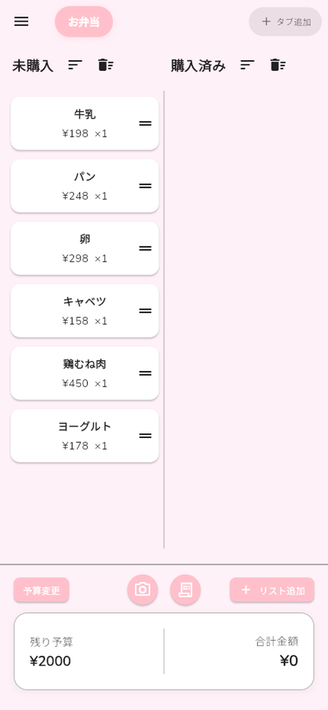
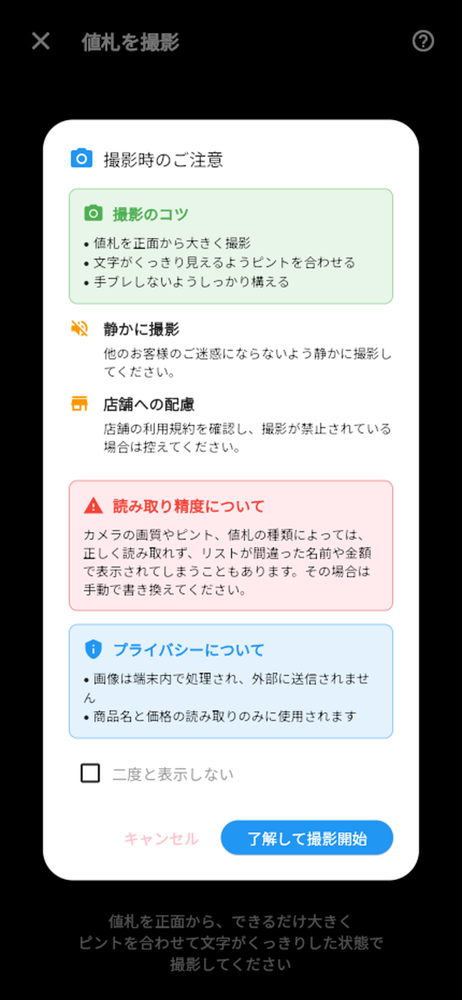
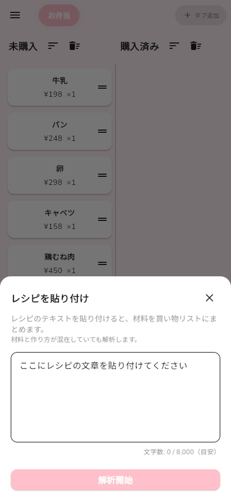

# まいカゴ — 買い物リストアプリ

> 買い物の合計金額をリアルタイムに把握できるアプリ。

[](https://flutter.dev)
[](https://dart.dev)
[](https://firebase.google.com)
[]()
[](https://play.google.com/store/apps/details?id=com.ikcoding.maikago&hl=ja)

<p align="center">
  
  
  
  
</p>

## このアプリについて

スーパーで買い物をするとき、メモを見ながら電卓で合計を計算して…という手間を解消するために作った個人開発アプリです。[Google Play](https://play.google.com/store/apps/details?id=com.ikcoding.maikago&hl=ja) でリリース済み。

**v0.1.0 → <!-- latest-v -->v1.5.0<!-- /latest-v -->** まで<!-- dev-period -->約8ヶ月<!-- /dev-period -->、<!-- release-count -->56以上<!-- /release-count -->のリリースを重ねながら継続的に改善しています。

### 主な機能

- **カメラOCR** — 値札を撮影 → AI が商品名・税込価格を自動認識 → リストに即追加
- **リアルタイム合計** — 個数・割引率を含む合計金額を常に表示、予算オーバー警告
- **クラウド同期** — Google ログインで複数デバイス間リアルタイム同期
- **タブ管理** — Chrome風タブで店舗ごとにリストを切り替え、共有タブで家族と共同編集
- **レシピ取り込み** — レシピURLから材料を自動解析してリストに一括追加
- **14種テーマ** — ライト/ダークモード対応、フォント選択
- **ゲストモード** — ログインなしでも即利用可能
- **プレミアム（買い切り）** — 広告非表示、リスト・タブ無制限

## アーキテクチャ

```
┌─────────────────────────────────────────────────┐
│                   UI Layer                       │
│          Screens / Widgets / Dialogs             │
├─────────────────────────────────────────────────┤
│                State Management                  │
│    Provider (AuthProvider, DataProvider, etc.)    │
├──────────────┬──────────────────────────────────┤
│ Repositories │          Managers                 │
│ (CRUD操作)    │ (キャッシュ/同期/共有グループ)        │
├──────────────┴──────────────────────────────────┤
│                Service Layer                     │
│   Auth / OCR / Camera / IAP / Recipe / Theme     │
├─────────────────────────────────────────────────┤
│                  Firebase                        │
│   Firestore / Auth / Cloud Functions / Hosting   │
└─────────────────────────────────────────────────┘
```

### 技術選定の理由

| 技術 | 選定理由 |
|------|----------|
| **Flutter** | iOS / Android / Web をワンコードベースで開発。個人開発で3プラットフォーム対応を実現 |
| **Provider** | シンプルな状態管理で学習コストが低く、このアプリ規模に適切。過剰な抽象化を避けた |
| **Cloud Firestore** | リアルタイム同期が標準搭載。共有タブ機能でのリアルタイム共同編集を実現 |
| **Cloud Functions** | OCR/AI処理をサーバーサイドに集約し、APIキーをクライアントに露出させない設計 |
| **go_router** | 宣言的ルーティングで認証リダイレクトを一元管理。画面遷移の見通しが良い |

## エンジニアリングのこだわり

### 楽観的更新パターン
Firestore への書き込みを待たず UI を即座に更新。ユーザー体感速度を優先しつつ、バックグラウンドで整合性を担保。

### テーマシステム
14種のカラーテーマを `SettingsTheme.generateTheme()` で動的生成。ハードコード色を排除し、全画面でライト/ダークモードの一貫性を保証。リファクタリングで全ファイルのハードコード色をテーマ変数に統一。

### OCR パイプライン
`Camera → Cloud Functions (Vision API) → ChatGPT (商品名整形・価格抽出) → 確認画面 → リスト追加` の多段パイプライン。税込価格の優先認識、カンマ区切りの自動解析など、日本の小売店の値札に最適化。

### ファサードパターンによるデータ層
`DataProvider` をファサードとし、内部で `ItemRepository` / `ShopRepository` / `DataCacheManager` / `RealtimeSyncManager` / `SharedGroupManager` に責務を分離。500行ルールを設けてファイル肥大化を防止。

### セキュリティ設計
APIキーは `--dart-define` + Cloud Functions + Secret Manager で管理。Firestore セキュリティルールで `request.auth.uid == userId` の最小権限を徹底。クライアントからの寄付データ書き込みは Cloud Functions 経由のみ許可。

## 技術スタック

| カテゴリ | 技術 |
|----------|------|
| フレームワーク | Flutter (Dart 3.x) |
| 状態管理 | Provider |
| ルーティング | go_router |
| 認証 | Firebase Auth + Google Sign-In |
| DB | Cloud Firestore（リアルタイム同期） |
| サーバー | Firebase Cloud Functions (Node.js 20) |
| AI/OCR | Vision API + ChatGPT（Cloud Functions経由） |
| 課金 | in_app_purchase（買い切りモデル） |
| 広告 | google_mobile_ads |
| CI/CD | Codemagic (iOS/Android) + GitHub Actions (Web) |
| テスト | flutter_test + mockito |

## プロジェクト規模

| 指標 | 数値 |
|------|------|
| Dart ファイル数 | <!-- dart-files -->137<!-- /dart-files --> |
| 総コード行数 | <!-- loc -->~25000行<!-- /loc --> |
| コミット数 | <!-- commits -->559+<!-- /commits --> |
| リリース数 | <!-- releases -->56+ (v0.1.0 → v1.5.0)<!-- /releases --> |
| 開発期間 | <!-- dev-period2 -->約8ヶ月<!-- /dev-period2 -->（継続中） |
| テストファイル | <!-- test-files -->10<!-- /test-files --> |

## プロジェクト構造

```
lib/
├── main.dart / router.dart      # エントリーポイント、ルーティング
├── models/                      # データモデル（8ファイル）
├── providers/                   # 状態管理
│   ├── auth_provider.dart       #   認証状態
│   ├── data_provider.dart       #   データファサード
│   ├── theme_provider.dart      #   テーマ状態
│   ├── repositories/            #   CRUD（item, shop）
│   └── managers/                #   キャッシュ / 同期 / 共有グループ
├── services/                    # ビジネスロジック（20+ファイル）
│   ├── ad/ purchase/            #   広告・課金
│   ├── hybrid_ocr_service.dart  #   OCR処理
│   ├── settings_theme.dart      #   テーマ定義（14種生成）
│   └── ...                      #   認証, カメラ, レシピ解析 等
├── screens/                     # UI画面
│   ├── main/                    #   メイン（dialogs / widgets / utils）
│   └── drawer/                  #   設定 / 寄付 / 使い方 等
├── widgets/                     # 共通ウィジェット（CommonDialog 等）
└── utils/                       # SnackBar, ダイアログ, フォーマッタ 等

functions/                       # Cloud Functions（OCR・AI処理）
```

## セットアップ

```bash
git clone https://github.com/IKcoding-jp/maikago.git
cd maikago
flutter pub get

# Firebase設定（google-services.json / GoogleService-Info.plist 配置）
# 環境変数は --dart-define で注入（詳細: lib/env.dart）

flutter run
```

## CI/CD

| パイプライン | ツール | トリガー |
|-------------|--------|----------|
| iOS テスト + TestFlight 配信 | Codemagic | リリースブランチ |
| Android ビルド | Codemagic | リリースブランチ |
| Web デプロイ | GitHub Actions | main マージ時 |
| Web プレビュー | GitHub Actions | PR 作成時 |

## ライセンス

MIT License

---

**開発者**: IK
スーパーで電卓とメモを行ったり来たりするのが面倒で、自分が欲しかったから作りました。
Issues・Pull Request 歓迎です。
