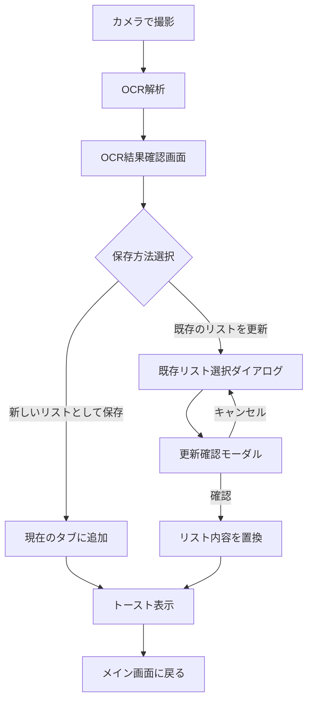

# 実装計画: OCR読み取り結果の既存リスト更新機能

## 概要

まいカゴアプリにOCR読み取り結果を既存の買い物リストに上書き更新できる機能を追加します。現在はOCR結果を直接リストに追加していますが、新機能ではOCR結果確認画面を表示し、ユーザーが「新規保存」か「既存リスト更新」を選択できるようにします。

## User Review Required

> [!IMPORTANT]
> 要件定義書によると「OCRセッション履歴」をデータベースに保存する設計がありますが、現在のアプリはFirestoreをデータ永続化に使用しています。OCRセッション履歴の永続化については、以下の2つの選択肢があります：
> 1. **Firestoreに保存**: `ocr_sessions`コレクションを追加
> 2. **端末ローカルに保存**: SharedPreferencesを使用（シンプルだがデバイス間同期なし）
>
> 今回の実装では、要件の主要機能（OCR結果確認画面と既存リスト更新）に集中し、OCRセッション履歴の保存は後回しにすることを推奨します。

> [!IMPORTANT]
> 要件定義書では「AIによる更新候補提示」機能がありますが、これは補助機能として後で実装することを推奨します。まずは基本的な「新規保存/既存リスト更新」の選択フローを実装します。

---

## Proposed Changes

### モデル

#### [NEW] [ocr_session_result.dart](file:///d:/Dev/maikago/lib/models/ocr_session_result.dart)
OCR結果を一時的に保持するモデルクラス。

```dart
class OcrSessionResultItem {
  final String name;
  final int price;
  final int quantity;
  
  // fromJson, toJson, copyWith メソッド
}

class OcrSessionResult {
  final List<OcrSessionResultItem> items;
  final DateTime createdAt;
  final String? rawOcrText;
  
  // 合計金額の計算プロパティ
  int get totalPrice => items.fold(0, (sum, item) => sum + item.price * item.quantity);
}
```

---

### サービス

#### [MODIFY] [data_provider.dart](file:///d:/Dev/maikago/lib/providers/data_provider.dart)

既存リスト更新メソッドを追加：

```dart
/// 既存リストをOCR結果で完全に置き換える
Future<void> replaceShopItems(String shopId, List<ListItem> newItems) async {
  // 1. 対象ショップを取得
  // 2. 既存のアイテムを全て削除
  // 3. 新しいアイテムを追加
  // 4. ショップの更新日時を更新
}
```

---

### 画面・ウィジェット

#### [NEW] [ocr_result_confirm_screen.dart](file:///d:/Dev/maikago/lib/screens/ocr_result_confirm_screen.dart)

OCR結果確認・編集画面。以下の機能を持つ：

1. **商品リスト表示・編集**
   - 商品名の編集
   - 価格の編集
   - 数量の変更
   - アイテムの削除・追加

2. **保存方法選択UI**
   - ラジオボタンで選択
   - 「新しいリストとして保存」（デフォルト）
   - 「既存のリストを最新にする」

3. **合計金額表示**

```dart
class OcrResultConfirmScreen extends StatefulWidget {
  final OcrSessionResult ocrResult;
  final String currentShopId;
  
  // ...
}
```

---

#### [NEW] [existing_list_selector_dialog.dart](file:///d:/Dev/maikago/lib/widgets/existing_list_selector_dialog.dart)

既存リスト選択ダイアログ：

- 全ショップ（タブ）の一覧を表示
- 各リストの情報表示:
  - リスト名（タブ名）
  - 最終更新日時
  - 商品数
  - 合計金額
- ユーザーは1つを選択

---

#### [NEW] [update_confirm_dialog.dart](file:///d:/Dev/maikago/lib/widgets/update_confirm_dialog.dart)

更新確認モーダル：

```dart
class UpdateConfirmDialog extends StatelessWidget {
  final String targetListName;
  final int currentItemCount;
  final int newItemCount;
  final VoidCallback onConfirm;
  final VoidCallback onCancel;
}
```

- 「○○の内容を更新しますか？」のメッセージ
- 更新実行ボタンとキャンセルボタン
- 処理中はローディング表示

---

#### [MODIFY] [bottom_summary_widget.dart](file:///d:/Dev/maikago/lib/screens/main/widgets/bottom_summary_widget.dart)

`_handleImageCaptured`メソッドを変更して、OCR結果確認画面に遷移させる：

```dart
// 現在のコード:
// final item = ListItem(...);
// await dataProvider.addItem(item);

// 変更後:
// OCR結果からOcrSessionResultを作成
final ocrResult = OcrSessionResult(
  items: [OcrSessionResultItem(name: res.name, price: res.price, quantity: 1)],
  createdAt: DateTime.now(),
);

// OCR結果確認画面に遷移
final saveResult = await Navigator.of(context).push<SaveResult>(
  MaterialPageRoute(
    builder: (context) => OcrResultConfirmScreen(
      ocrResult: ocrResult,
      currentShopId: widget.shop.id,
    ),
  ),
);

// 保存完了のトースト表示
if (saveResult != null && saveResult.isSuccess) {
  ScaffoldMessenger.of(context).showSnackBar(
    SnackBar(content: Text(saveResult.message)),
  );
}
```

---

## 画面遷移フロー



---

## ファイル構成

```
lib/
├── models/
│   ├── list.dart (既存)
│   ├── shop.dart (既存)
│   └── ocr_session_result.dart [NEW]
├── providers/
│   └── data_provider.dart [MODIFY - replaceShopItemsメソッド追加]
├── screens/
│   └── ocr_result_confirm_screen.dart [NEW]
└── widgets/
    ├── existing_list_selector_dialog.dart [NEW]
    └── update_confirm_dialog.dart [NEW]
```

---

## Verification Plan

### 自動テスト
- モデルクラスのユニットテスト（シリアライズ/デシリアライズ）

### 手動検証
1. **新規保存フロー**
   - カメラで撮影 → OCR結果確認 → 「新しいリストとして保存」選択 → 現在のタブにアイテム追加される
   
2. **既存リスト更新フロー**
   - カメラで撮影 → OCR結果確認 → 「既存のリストを更新」選択 → リスト選択ダイアログ → 確認モーダル → リスト内容が置換される
   
3. **編集機能**
   - OCR結果確認画面で商品名/価格/数量を編集できる
   - アイテムの削除/追加ができる
   
4. **エラーケース**
   - OCR失敗時の挙動
   - 保存失敗時のエラーメッセージ
   - 二重送信防止の動作確認
