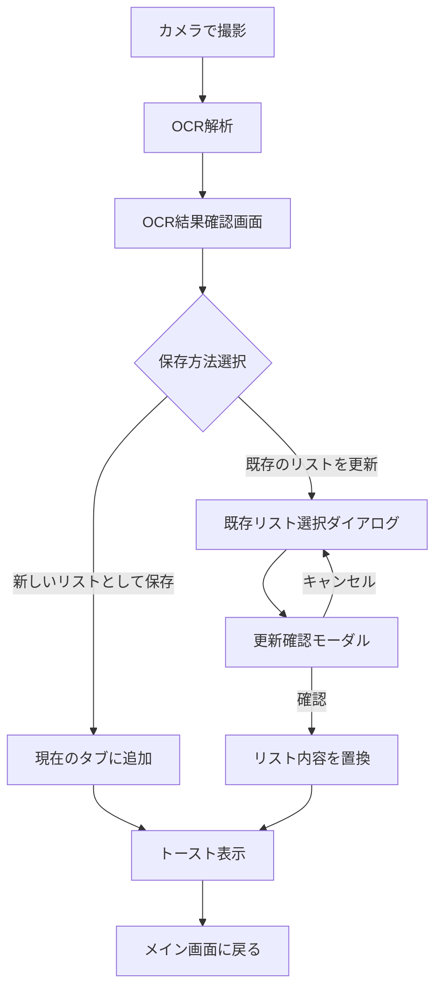

# OCR読み取り結果の既存リスト更新機能 - 実装完了レポート

## 概要

まいカゴアプリにOCR読み取り結果を既存の買い物リストに上書き更新できる機能を実装しました。

---

## 実装内容

### 新規作成ファイル

#### [ocr_session_result.dart](file:///d:/Dev/maikago/lib/models/ocr_session_result.dart)
OCR結果を一時的に保持するモデルクラス。

- `OcrSessionResultItem`: 商品名、価格、数量を保持
- `OcrSessionResult`: 商品リストと作成日時を保持
- `SaveResult`: 保存処理の結果（成功/失敗、メッセージ）

---

#### [ocr_result_confirm_screen.dart](file:///d:/Dev/maikago/lib/screens/ocr_result_confirm_screen.dart)
OCR結果確認・編集画面。

**機能:**
- 商品名、価格、数量の編集
- アイテムの追加・削除
- 合計金額のリアルタイム表示
- 保存方法の選択（新規追加/既存更新）

---

#### [existing_list_selector_dialog.dart](file:///d:/Dev/maikago/lib/widgets/existing_list_selector_dialog.dart)
既存リスト選択ダイアログ。

**表示内容:**
- リスト名（タブ名）
- 商品数
- 合計金額
- 最終更新日時
- 現在選択中のタブを「現在」ラベルで表示

---

#### [update_confirm_dialog.dart](file:///d:/Dev/maikago/lib/widgets/update_confirm_dialog.dart)
更新確認モーダル。

**機能:**
- 対象リスト名の明示
- 現在の商品数と新しい商品数の比較表示
- 新しい合計金額の表示
- 二重送信防止（処理中はボタン無効化）
- ローディング表示

---

### 変更ファイル

#### [bottom_summary_widget.dart](file:///d:/Dev/maikago/lib/screens/main/widgets/bottom_summary_widget.dart)

`_handleImageCaptured`メソッドを変更し、OCR結果確認画面に遷移するようにしました。

```diff
 // 変更前: OCR結果を直接リストに追加
-final item = ListItem(...);
-await dataProvider.addItem(item);

 // 変更後: OCR結果確認画面に遷移
+final ocrResult = OcrSessionResult(items: [...]);
+final saveResult = await Navigator.of(context).push<SaveResult>(
+  MaterialPageRoute(builder: (_) => OcrResultConfirmScreen(...)),
+);
```

---

## 画面遷移フロー



---

## 検証結果

| 項目 | 結果 |
|------|------|
| 静的解析（dart analyze） | ✅ エラーなし |
| MCPサーバー解析 | ✅ エラーなし |
| RadioListTile警告 | ⚠️ 非推奨警告（Flutter 3.32以降で変更予定、機能に影響なし） |

---

## 未実装項目（今後の拡張機能）

| 項目 | 説明 |
|------|------|
| AIによる類似度判定 | OCR結果と既存リストを比較し、類似度が高いリストをおすすめ表示 |
| OCRセッション履歴保存 | Firestore/SharedPreferencesへのOCR履歴保存 |

---

## 使い方

1. メイン画面下部の「カメラで追加」ボタンをタップ
2. 値札を撮影
3. OCR結果確認画面で内容を確認・編集
4. 保存方法を選択:
   - **新しいリストとして保存**: 現在のタブに商品を追加
   - **既存のリストを最新にする**: 選択したリストの内容を完全に置換
5. 保存完了後、トースト通知が表示される
