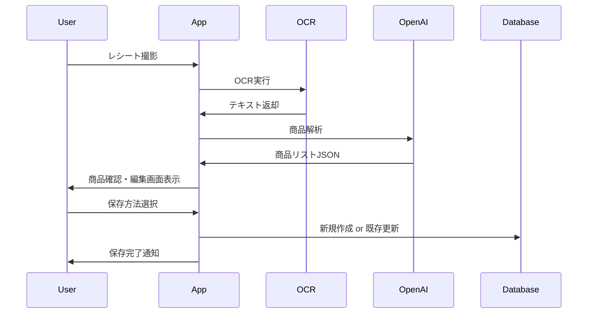

# 要件定義書

## 機能名：OCR読み取り結果の既存リスト更新（上書き）機能

対象アプリ：まいカゴ

---

## 1. 目的

OCRおよびOpenAIによって読み取った買い物内容をリスト化する際、
**既存の買い物リストをユーザーの明示的な操作によって更新（上書き）できる機能**を提供し、
リストの重複増加や管理負荷を軽減する。

---

## 2. 前提条件・基本方針

* OCR読み取り後は **必ず商品リスト確認画面を表示**する
* デフォルト動作は **新規リスト作成**
* 既存リストの更新（上書き）は

  * ユーザーが明示的に選択した場合のみ実行する
  * 自動上書きは行わない
* 「上書き」という文言はUI上では使用せず、「更新」「最新にする」で表現する

---

## 3. 機能要件（エンドユーザー向け）

### 3.1 OCR・解析機能

* レシート画像をOCRで読み取る
* OCR結果をOpenAIで解析し、以下の情報を抽出する

  * 商品名
  * 価格
  * 数量
  * 合計金額（可能な場合）

---

### 3.2 OCR結果確認・編集画面

* OCR解析後、商品リスト確認画面を表示する
* ユーザーは以下を編集可能とする

  * 商品名
  * 価格
  * 数量
  * 商品の削除・追加

---

### 3.3 リスト保存方法選択UI

OCR結果確認画面に以下の選択UIを表示する。

#### 選択肢

* 新しいリストとして保存（デフォルト）
* 既存のリストを最新にする

※ ユーザーはいずれか一つを必ず選択する

---

### 3.4 既存リスト更新（上書き）機能

「既存のリストを最新にする」を選択した場合：

* 既存リスト一覧を表示する
* 各リストには以下の情報を表示する

  * リスト名
  * 最終更新日時
  * 商品数
  * 合計金額
* ユーザーは更新対象のリストを1つ選択する

---

### 3.5 更新確認モーダル

既存リストを選択後、確認モーダルを表示する。

* 対象リスト名を明示する
* 更新実行ボタンを押下した場合のみ、内容を置き換える
* キャンセル時は保存方法選択画面に戻る

---

### 3.6 AIによる更新候補提示（補助機能）

* OCR結果と既存リストの内容を比較する
* 類似度が高いリストを「おすすめ」として一覧上部に表示する
* 自動選択・自動更新は行わない

---

### 3.7 保存処理

* 新規リスト保存時

  * 新しいリストレコードを作成する
* 既存リスト更新時

  * 対象リストの内容をOCR結果で完全に置き換える
  * 更新日時を更新する
* 保存完了後、トースト通知を表示する

---

## 4. 非機能要件

* 誤操作防止のため、既存リスト更新は必ず確認ステップを挟む
* UI上で「上書き」という直接的な表現は使用しない
* 保存処理は二重送信を防止する
* 処理中はローディング表示を行う

---

## 5. データベース設計

### 5.1 lists（買い物リスト）

| カラム名        | 型        | 説明    |
| ----------- | -------- | ----- |
| id          | UUID     | リストID |
| title       | string   | リスト名  |
| total_price | integer  | 合計金額  |
| created_at  | datetime | 作成日時  |
| updated_at  | datetime | 更新日時  |

---

### 5.2 list_items（商品）

| カラム名     | 型       | 説明       |
| -------- | ------- | -------- |
| id       | UUID    | 商品ID     |
| list_id  | UUID    | 紐づくリストID |
| name     | string  | 商品名      |
| price    | integer | 単価       |
| quantity | integer | 数量       |

---

### 5.3 ocr_sessions（OCR処理履歴）

| カラム名          | 型        | 説明         |
| ------------- | -------- | ---------- |
| id            | UUID     | OCRセッションID |
| raw_text      | text     | OCR生テキスト   |
| parsed_result | json     | OpenAI解析結果 |
| created_at    | datetime | 実行日時       |

---

## 6. シーケンス図

---

## 7. 完了条件（Definition of Done）

* OCR結果を既存リストに任意で更新できる
* ユーザーの操作なしに既存リストが変更されない
* 新規保存と更新保存が明確に区別されている
* 誤操作によるデータ消失がUI設計上防止されている

---

以上が
**まいカゴ：OCR読み取り結果の既存リスト更新機能の要件定義書**です。
